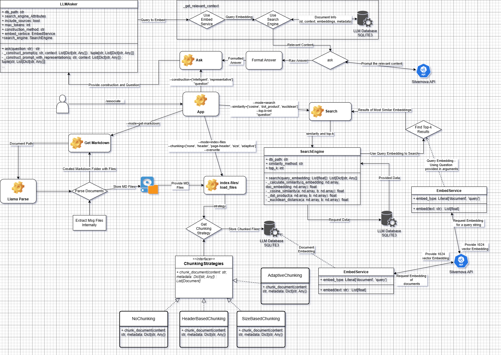

# Silvernova Assessment Task

Thank you for applying for a job at **silvernova**. We are excited to talk to you about working together.

We at silvernova think that creativity and new solutions when developing are hindered by a time constraint. Coding interviews can thus misrepresent your true skills. This is why we are using an asynchronous asseesment task concept. This task will help us understand how you go about solving problems without having to breathe down your neck. 😉

When working on this task either
  * fork this repo and submit a link to your submission via mail
  * clone the repo and send a zipped version via mail

## Your info (please fill out)

Try to answer as thruthfully as possible.

| Name                     | Batuhan Gündüz                   |
|--------------------------|----------------------------------|
| E-Mail:                  | e231529@gmail.com                |
| Approx. Time To Complete | ~4 hours of dealing environment setup <br> ~10 hours of wrong choice of tools <br> ~10 Learning unknown topics related with the project <br> ~6 hours of reimplementing <br> ~15 Testing the methods, db management, embedding similarity etc. <br> 8 hours of Test Implementations <br> 1.5 hour of UML Diagram    |
| My github:               | https://github.com/BatuhanGQskt/ |

## The task

Your task is to build a very simple [RAG](https://en.wikipedia.org/wiki/Retrieval-augmented_generation) that is able to answer questions on the provided demo documents. The documents represent what a lawyer will be working with on a day-to-day basis - although some will be harder to parse than others.

> The final application should provide an interface to talk to the assistant about the documents, ask questions, and retreive facts. For a lawyer's  job it's important that every piece of information they work with should be backed by sources, so every answer should be as specific as possible, pointing not only to the source document, but ideally to the sentence or paragraph where the information is located.

This repository already has a basic structure to help you get started and point you in the right direction. Your tasks are to:

- [x] Familiarize yourself with the codebase and the parts that need changes 
- [x] Complete the **extraction script** to embed the information from the documents in markdown format
- [x] Complete the **embedding script** to embed the documents' information for later retreival
- [x] Complete the **search script** to retreive the embedded documents that most closely resemble the search query
- [x] Complete the **ask script** to ask questions about the documents
- [x] Complete the **tests** and make sure they run

## Setup

```bash
python -m venv venv
source ./venv/Script/activate
pip install -r requirements.txt
```

## API

We've provided an API access for you that allows you to embed text and prompt an LLM. The API is running at [https://assessment.silvrnova.ai](https://assessment.silvrnova.ai). 

You can find the OpenAPI specification here: [OpenAPI Specification](https://assessment.silvernova.ai/swagger).

You have to authenticate at the API. Use your assigned **API Key** for that purpose. Put it into a `.env` file located in the root of the project.

## Run
```bash
# Basic Usage (default values used)

# Get the file's content as markdown
./associate --mode=get-markdown

# Index the documents
./associate --mode=index-files

# Search for documents based on similarity
./associate --mode=search "[question]"

# Ask a question about the documents
./associate "[question]"

# ============= Advanced Usage with Different Methods =============

# Index the documents, select the chunking method, and overwrite the DB if already indexed files
# Footnote: --overwrite has some functionality issue and cannot actually overwrites the current documents due to id difference.
./associate --mode=index-files --chunking=['none', 'header', 'page-header', 'size', 'adaptive'] --overwrite

# Search for documents based on similarity, select different similarity methods (mostly gives the same results)
# top-k should be integer.
./associate --mode=search --similarity=['cosine', 'dot_product', 'euclidean'] --top-k=TOPK "[question]"

# Ask a question about the documents, first two arguments are same with the search method.
# Construction is a method to construct new prompt via select method.
./associate --similarity=['cosine', 'dot_product', 'euclidean'] --top-k=TOPK --construction=['intelligent', 'representative'] "[question]"
```

## Run Tests
```python
# Run all tests
python -m unittest discover -s tests

# Run specific test file
python -m unittest tests/test_chunking.py
python -m unittest tests/test_search.py
python -m unittest tests/test_llm_asker.py
python -m unittest tests/test_integration.py

# Run specific test case
python -m unittest tests.test_chunking.TestChunkingStrategies
python -m unittest tests.test_search.TestSearchEngine
```


## Important points to usage
### Get Markdown
* While using get-markdown please be sure related documents are closed, otherwise open documents cannot be markdown since OS doesn't allow program to read used files.
### Asking Question
* I added **construction** argument to select between intelligent and representative construction. Intelligent construction adds the documents directly if token limit is not exceeded. However, representative construction is applied every time when it is used which chunk down the selected documents and extract the document further using same strategy of chunking and comparison of similarity, and select a representative of each document with the highest similarity.

# Workflow Diagram



## Experimental Findings:
* Following input results ($ ./associate --similarity=dot_product --top-k=3 "Was ist NDA 4.2?") results in a better result as:
**Kontext**<br>==========<br><br>* **Dokument 1-3**: Auszüge aus einem Mutual Non-Disclosure Agreement (NDA)<br>        + **Relevanter Abschnitt für die Frage**: `4.2` (Dokument 3)<br><br>**Frage**<br>=======<br><br>* Was ist NDA 4.2?<br><br>**Antwort**<br>==========<br><br>**NDA 4.2: Anwendbares Recht und Gerichtsstand**<br><br>* **Zitat aus Dokument 3, #4.2**:<br>"This Agreement shall be construed and interpreted by the laws of Germany.<br>The court of Berlin shall have jurisdiction."<br><br>**Zusammenfassung**:<br>NDA 4.2 legt fest, dass für die Auslegung und Durchführung dieses Vertrags **deutsches Recht** Anwendung findet und dass für alle Streitigkeiten **das Gericht in Berlin** zuständig ist. <br><br>**Rechtliche Grundlage**:<br>- **Anwendbares Recht**: Gesetze der Bundesrepublik Deutschland<br>- **Gerichtsstand**: Amtsgericht oder Landgericht Berlin, je nach Streitwert oder Sachkompetenz.

Whereas, 
$ ./associate --similarity=dot_product --top-k=3 --construction=representative "Was ist NDA 4.2?"  and  
$ ./associate --similarity=dot_product --top-k=8 --construction=representative "Was ist NDA 4.2?"
failed to identify the correct answer.

## Bugs
* Caused with the call "./associate --mode=index-files --chunking=size --overwrite"
UPDATE of the SQLITE3 DB cannot be applied due to newly created chunks are assigned with new uuid which leads to overhead and duplicate chunks/documents. This should be revisit and uuid might be changed with {file_path}:page_count:chunk which promises to act like an id while keeping track of the source of the data precisely.
Also, this leads to immense expension because every possible new indexing files creates new data in the database everytime.


## Further Improvements
* Markdown can be improved with concurrent loading. Firstly, I tried this method, but it caused some problems with loading bars and functionality of the loading.
* Different Parsing methods can be applied to investigate possible parsing methods.
* Investigate construction methods other than intelligent and representative. 
* Different methods for indexing can be applied. Currently, I used searching index method which just create embeddings and rerank the embeddings with the similarity comparison, but there is **Clustering and Recommandations** which can be beneficial especially **Recommandations**.
* metadata[source] should be identified more clearly due to difficulty to understand in different chunked documents.
* Implement _construct_prompt_tree_structure for each document[source] create a root node and divide until some level of depth. Then, get the best k leaf node to represent the whole document.

